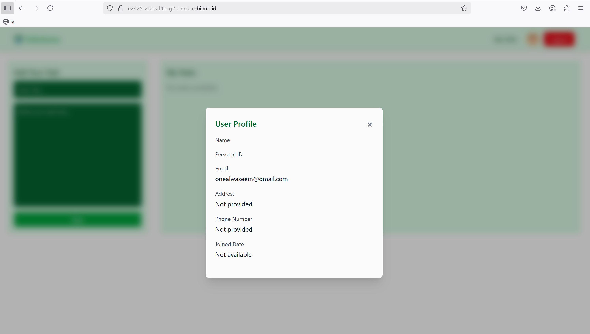

# OnealWaseem_2702342842_L4BC_WADS-LAB_Week12

This document provides detailed information about the creation of the logout endpoint, integration between frontend and backend using axios and Redux Toolkit, implementation of features from the /user-info endpoint, as well as CI/CD pipeline using docker and github actions.
The web app can be accessed through this link: https://e2425-wads-l4bcg2-viona.csbihub.id

## Frontend Screenshots

### 1. User Authentication
#### Sign Up

#### Login

#### User Profile

### 2. Todo Management
#### Main Page

#### Editing Tasks

#### Deleting Tasks

#### Email Verification
- **OTP Email**:
  
